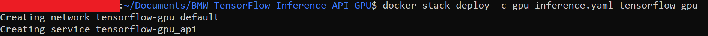
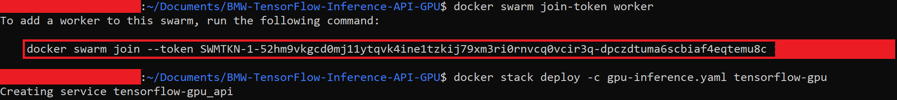
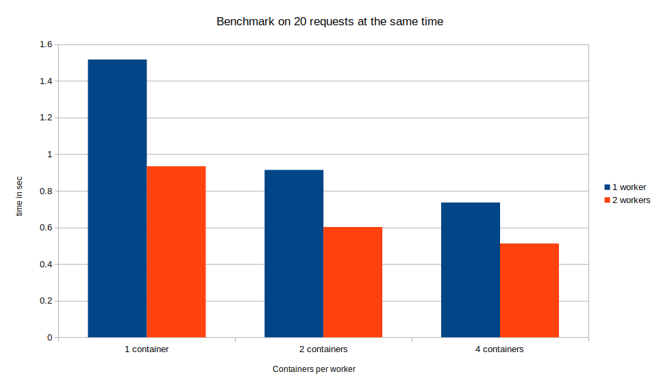
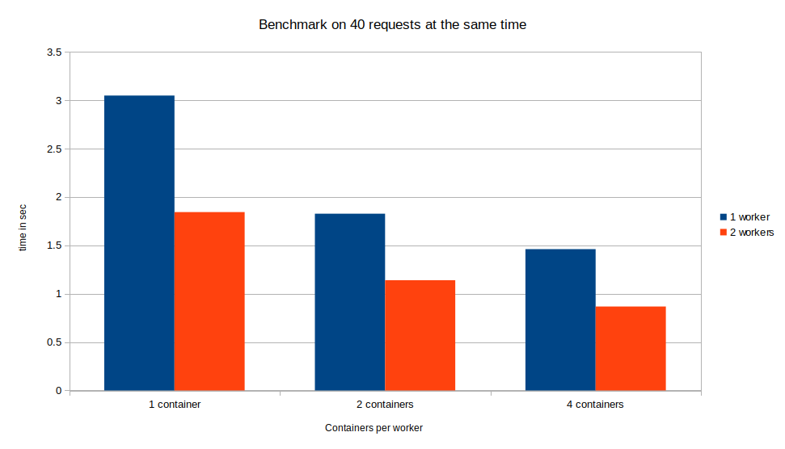

# Tensorflow GPU Inference API with docker swarm

Please use **docker swarm** only if you need to:

* Provide redundancy in terms of API containers: In case a container went down, the incoming requests will be redirected to another running instance.

* Coordinate between the containers: Swarm will orchestrate between the APIs and choose one of them to listen to the incoming request.

* Scale up the Inference service in order to get a faster prediction especially if there's traffic on the service.

## Run the docker container

Docker swarm can scale up the API into multiple replicas and can be used on one or multiple hosts. In both cases, a docker swarm setup is required for all hosts.

#### Docker swarm setup

1- Enable docker swarm GPU resource:

```sh
sudo nano /etc/nvidia-container-runtime/config.toml
```

Remove # from this line `swarm-resource = "DOCKER_RESOURCE_GPU"` to enable it then save and exit.

2- The `deploy` command supports compose file version 3.0+ and runtime command in a compose file is only supported with compose file version 2.3. So we won't be able to add runtime in our stack file that why we will add default runtime in docker json file:

```sh 
sudo nano /etc/docker/daemon.json
```

```json
{
  "default-runtime": "nvidia",
  "runtimes": {
    "nvidia": {
      "path": "/usr/bin/nvidia-container-runtime",
      "runtimeArgs": []
    }
  }
}
```

3- Finally restart docker:

```sh
sudo systemctl daemon-reload
sudo systemctl restart docker
```

4- Initialize Swarm:

```sh 
docker swarm init
```

5- On the manager host, open the gpu-inference.yaml file and specify the number of replicas needed. In case you are using multiple hosts (With multiple hosts section), the number of replicas will be divided across all hosts.

```yaml
version: "3"

services:
  api:
    environment:
      - "NVIDIA_VISIBLE_DEVICES=0"
    ports:
      - "4343:4343"
    image: tensorflow_inference_api_gpu
    volumes:
      - "/mnt/models:/models"
    deploy:
      replicas: 1
      update_config:
        parallelism: 2
        delay: 10s
      restart_policy:
        condition: on-failure
```
**Notes about gpu-inference.yaml:**
* the volumes field on the left of ":" should be an absolute path, can be changeable by the user, and represents the models directory on your Operating System
* the following volume's field ":/models" should never be changed
* NVIDIA_VISIBLE_DEVICES defines on which GPU you want the API to run

#### With one host

Deploy the API:

```sh
docker stack deploy -c gpu-inference.yaml tensorflow-gpu
```



#### With multiple hosts

1- **Make sure hosts are reachable on the same network**. 

2- Choose a host to be the manager and run the following command on the chosen host to generate a token so the other hosts can join:

```sh
docker swarm join-token worker
```

A command will appear on your terminal, copy and paste it on the other hosts, as seen in the below image

3- Deploy your application using:

```sh 
docker stack deploy -c gpu-inference.yaml tensorflow-gpu
```



#### Useful Commands

1- In order to scale up the service to 4 replicas for example use this command:

```sh
docker service scale tensorflow-gpu_api=4
```

2- To check the available workers:

```sh
docker node ls
```

3- To check on which node the container is running:

```sh
docker service ps tensorflow-gpu_api
```

4- To check the number of replicas:

```sh
docker service ls
```

## Benchmarking

Here are two graphs showing time of prediction for different number of requests at the same time.








We can see that both graphs got the same result no matter what is the number of received requests at the same time. When we increase the number of workers (hosts) we are able to speed up the inference. For example we can see in the last column we were able to process 40 requests in:

- 1.46 seconds with 4 replicas in 1 machine.
- 0.82 seconds with 4 replicas in each of the 2 machines.

Moreover, in case one of the machines is down the others are always ready to receive requests.

Finally since we are predicting on GPU, scaling more replicas means a faster prediction.
