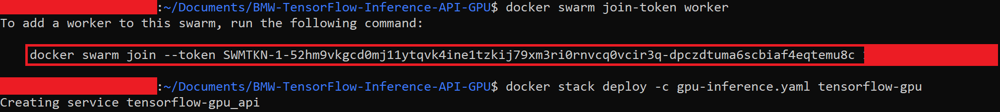

# Tensorflow GPU Inference API

This is a repository for an object detection inference API using the Tensorflow framework.

This repo is based on [Tensorflow Object Detection API](https://github.com/tensorflow/models/tree/master/research/object_detection).

The Tensorflow version used is 1.13.1. The inference REST API works on GPU. It's only supported on Linux Operating systems. 

Models trained using our training tensorflow repository can be deployed in this API. Several object detection models can be loaded and used at the same time.

This repo can be deployed using either **docker** or **docker swarm**.

Please use **docker swarm** only if you need to:

* Provide redundancy in terms of API containers: In case a container went down, the incoming requests will be redirected to another running instance.

* Coordinate between the containers: Swarm will orchestrate between the APIs and choose one of them to listen to the incoming request.

* Scale up the Inference service in order to get a faster prediction especially if there's traffic on the service.

If none of the aforementioned requirements are needed, simply use **docker**.


## Contents

```sh
Tensorflow GPU Inference API/
├── Prerequisites
│   ├── Check for prerequisites
│   └── Install prerequisites
├── Build The Docker Image
├── Run the docker container
│   ├── Docker
│   └── Docker swarm
│       ├── Docker swarm setup
│       ├── With one host
│       ├── With multiple hosts
│       └── Useful Commands
├── API Endpoints
├── Model structure
└── Benchmarking
    ├── Docker
    └── Docker swarm
```

## Prerequisites

- Ubuntu 18.04
- NVIDIA Drivers (410.x or higher)
- Docker CE latest stable release
- NVIDIA Docker 2

### Check for prerequisites

To check if you have docker-ce installed:

```sh
docker --version
```

To check if you have nvidia-docker installed:

```sh
nvidia-docker --version
```

**To check your nvidia drivers version, open your terminal and type the command `nvidia-smi`**


### Install prerequisites

Use the following command to install docker on Ubuntu:

```sh
chmod +x install_prerequisites.sh && source install_prerequisites.sh
```

Install NVIDIA Drivers (410.x or higher) and NVIDIA Docker for GPU by following the [official docs](https://github.com/nvidia/nvidia-docker/wiki/Installation-(version-2.0))

## Build The Docker Image

In order to build the project run the following command from the project's root directory:    

```sh
sudo docker build -t tensorflow_inference_api_gpu -f docker/dockerfile .
```

### Behind a proxy

```sh
sudo docker build --build-arg http_proxy='' --build-arg https_proxy='' -t tensorflow_inference_api_gpu -f ./docker/dockerfile .
```

## Run the docker container

### Docker

To run the API, go the to the API's directory and run the following:

#### Using Linux based docker:

```sh
sudo NV_GPU=0 nvidia-docker run -itv $(pwd)/models:/models -p <docker_host_port>:4343 tensorflow_inference_api_gpu
```

The <docker_host_port> can be any unique port of your choice.

The API file will be run automatically, and the service will listen to http requests on the chosen port.

NV_GPU defines on which GPU you want the API to run. If you want the API to run on multiple GPUs just enter multiple numbers seperated by a comma: (NV_GPU=0,1 for example)

In case you are deploying your API without **docker swarm**, please skip the next section and directly proceed to *API endpoints section*.

### Docker swarm

Docker swarm can scale up the API into multiple replicas and can be used on one or multiple hosts. In both cases, a docker swarm setup is required for all hosts.

#### Docker swarm setup

1- Enable docker swarm GPU resource:

```sh
sudo nano /etc/nvidia-container-runtime/config.toml
```

Remove # from this line `swarm-resource = "DOCKER_RESOURCE_GPU"` to enable it then save and exit.

2- The `deploy` command supports compose file version 3.0+ and runtime command in a compose file is only supported with compose file version 2.3. So we won't be able to add runtime in our stack file that why we will add default runtime in docker json file:

```sh 
sudo nano /etc/docker/daemon.json
```

```json
{
  "default-runtime": "nvidia",
  "runtimes": {
    "nvidia": {
      "path": "/usr/bin/nvidia-container-runtime",
      "runtimeArgs": []
    }
  }
}
```

3- Finally restart docker:

```sh
sudo systemctl daemon-reload
sudo systemctl restart docker
```

4- Initialize Swarm:

```sh 
docker swarm init
```

5- On the manager host, open the gpu-inference.yaml file and specify the number of replicas needed. In case you are using multiple hosts (With multiple hosts section), the number of replicas will be divided across all hosts.
```yaml
version: "3"

services:
  api:
    environment:
      - "NVIDIA_VISIBLE_DEVICES=0"
    ports:
      - "4343:4343"
    image: tensorflow_inference_api_gpu
    volumes:
      - "/mnt/models:/models"
    deploy:
      replicas: 1
      update_config:
        parallelism: 2
        delay: 10s
      restart_policy:
        condition: on-failure
```
**Notes about gpu-inference.yaml:**
* the volumes field on the left of ":" should be an absolute path, can be changeable by the user, and represents the models directory on your Operating System
* the following volume's field ":/models" should never be changed
* NVIDIA_VISIBLE_DEVICES defines on which GPU you want the API to run

#### With one host

Deploy the API:

```sh
docker stack deploy -c gpu-inference.yaml tensorflow-gpu
```


#### With multiple hosts

1- **Make sure hosts are reachable on the same network**. 

2- Choose a host to be the manager and run the following command on the chosen host to generate a token so the other hosts can join:

```sh
docker swarm join-token worker
```

A command will appear on your terminal, copy and paste it on the other hosts, as seen in the below image

3- Deploy your application using:

```sh 
docker stack deploy -c gpu-inference.yaml tensorflow-gpu
```



#### Useful Commands

1- In order to scale up the service to 4 replicas for example use this command:

```sh
docker service scale tensorflow-gpu_api=4
```

2- To check the available workers:

```sh
docker node ls
```

3- To check on which node the container is running:

```sh
docker service ps tensorflow-gpu_api
```

4- To check the number of replicas:

```sh
docker service ls
```

## API Endpoints

To see all available endpoints, open your favorite browser and navigate to:

```
http://<machine_IP>:<docker_host_port>/docs
```
The 'predict_batch' endpoint is not shown on swagger. The list of files input is not yet supported.

**P.S: If you are using custom endpoints like /load, /detect, and /get_labels, you should always use the /load endpoint first and then use /detect or /get_labels**

### Endpoints summary

#### /load (GET)

Loads all available models and returns every model with it's hashed value. Loaded models are stored and aren't loaded again


#### /detect (POST)

Performs inference on specified model, image, and returns bounding-boxes


#### /get_labels (POST)

Returns all of the specified model labels with their hashed values


#### /models/{model_name}/predict_image (POST)

Performs inference on specified model, image, draws bounding boxes on the image, and returns the actual image as response


#### /models (GET)

Lists all available models

#### /models/{model_name}/load (GET)

Loads the specified model. Loaded models are stored and aren't loaded again

#### /models/{model_name}/predict (POST)

Performs inference on specified model, image, and returns bounding boxes.

#### /models/{model_name}/labels (GET)

Returns all of the specified model labels

#### /models/{model_name}/config (GET)

Returns the specified model's configuration

#### /models/{model_name}/predict_batch (POST)

Performs inference on specified model and a list of images, and returns bounding boxes

**P.S: Custom endpoints like /load, /detect, and /get_labels should be used in a chronological order. First you have to call /load, and then call /detect or /get_labels**

## Model structure

The folder "models" contains subfolders of all the models to be loaded.
Inside each subfolder there should be a:

- pb file (frozen_inference_graph.pb): contains the model weights

- pbtxt file (object-detection.pbtxt): contains model classes

- Config.json (This is a json file containing information about the model)

  ```json
    {
        "inference_engine_name": "tensorflow_detection",
        "confidence": 60,
        "predictions": 15,
        "number_of_classes": 2,
        "framework": "tensorflow",
        "type": "detection",
        "network": "inception"
    }
  ```
  P.S:
  - You can change confidence and predictions values while running the API
  - The API will return bounding boxes with a confidence higher than the "confidence" value. A high "confidence" can show you only accurate predictions
    - The "predictions" value specifies the maximum number of bounding boxes in the API response

## Benchmarking

### Docker

<table>
    <thead align="center">
        <tr>
            <th></th>
            <th>Windows</th>
            <th colspan=3>Ubuntu</th>
        </tr>
    </thead>
    <thead align="center">
        <tr>
            <th>Network\Hardware</th>
            <th>Intel Xeon CPU 2.3 GHz</th>
            <th>Intel Xeon CPU 2.3 GHz</th>
            <th>Intel Xeon CPU 3.60 GHz</th>
            <th>GeForce GTX 1080</th>
        </tr>
    </thead>
    <tbody align="center">
        <tr>
            <td>ssd_fpn</td>
            <td>0.867 seconds/image</td>
            <td>1.016 seconds/image</td>
            <td>0.434 seconds/image</td>
            <td>0.0658 seconds/image</td>
        </tr>
        <tr>
            <td>frcnn_resnet_50</td>
            <td>4.029 seconds/image</td>
            <td>4.219 seconds/image</td>
            <td>1.994 seconds/image</td>
            <td>0.148 seconds/image</td>
        </tr>
        <tr>
            <td>ssd_mobilenet</td>
            <td>0.055 seconds/image</td>
            <td>0.106 seconds/image</td>
            <td>0.051 seconds/image</td>
            <td>0.052 seconds/image</td>
        </tr>
        <tr>
            <td>frcnn_resnet_101</td>
            <td>4.469 seconds/image</td>
            <td>4.985 seconds/image</td>
            <td>2.254 seconds/image</td>
            <td>0.364 seconds/image</td>
        </tr>
        <tr>
            <td>ssd_resnet_50</td>
            <td>1.34 seconds/image</td>
            <td>1.462 seconds/image</td>
            <td>0.668 seconds/image</td>
            <td>0.091 seconds/image</td>
        </tr>
        <tr>
            <td>ssd_inception</td>
            <td>0.094 seconds/image</td>
            <td>0.15 seconds/image</td>
            <td>0.074 seconds/image</td>
            <td>0.0513 seconds/image</td>
        </tr>
    </tbody>
</table>

### Docker swarm

Here are two graphs showing time of prediction for different number of requests at the same time.


We can see that both graphs got the same result no matter what is the number of received requests at the same time. When we increase the number of workers (hosts) we are able to speed up the inference. For example we can see in the last column we were able to process 40 requests in:

- 1.46 seconds with 4 replicas in 1 machine.
- 0.82 seconds with 4 replicas in each of the 2 machines.

Moreover, in case one of the machines is down the others are always ready to receive requests.

Finally since we are predicting on GPU, scaling more replicas means a faster prediction.

## Acknowledgment

[inmind.ai](https://inmind.ai)

[robotron.de](https://robotron.de)

Joe Sleiman, inmind.ai , Beirut, Lebanon

Antoine Charbel, inmind.ai, Beirut, Lebanon